# playbox

An old wine box with four buttons for my son. Now, he can listen to music when he wants.
There are four buttons to play mp3s and two buttons for controlling volume (up/down).

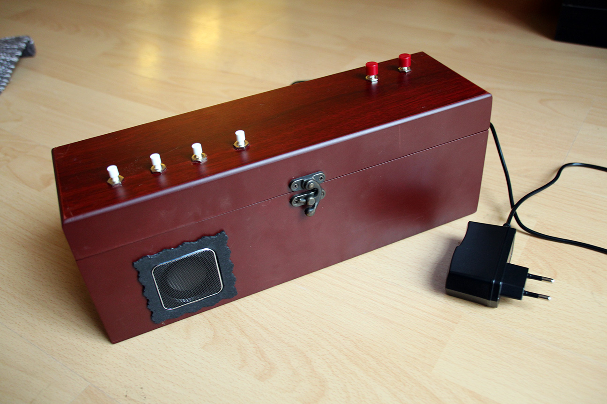

- When you plugin power, the system will need a few seconds to come up. When the box is ready, it will play a sound.
- You can press any of the four buttons and the respective mp3 in the sounds folder will be played.
- You can turn the volume up and down.
- If you hold volume up and then press volume down, the system will shutdown (a sound will be played).  
  Wait 5 seconds and then you can safely unplug power.

## Needed parts

- Any casing (I had an old wine case lying around)
- Raspberry Pi with SD-Card (doesn't matter which one)
- optionally USB Wifi Adapter for more convenient access
- Loudspeaker (USB-powered)
- Six buttons
- 1 LED, 300 Ohm resistor
- Wires

## Hardware

Find the [pinout](http://pi4j.com/images/p1header.png) here and then solder everything as depicted in the following diagram:

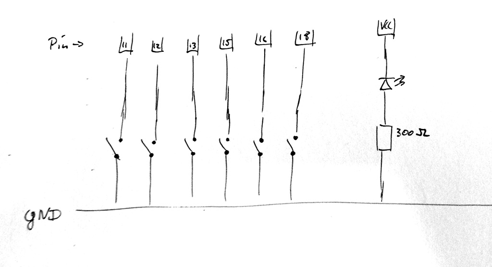

**Please note that I am using the internal pull-up resistors of for the switches.**

## Software installation

Install Raspberry Pi's SD card [with Raspbian](https://www.raspberrypi.org/help/noobs-setup/) and [setup wifi](https://learn.adafruit.com/adafruits-raspberry-pi-lesson-3-network-setup/setting-up-wifi-with-occidentalis).
Find the IP with `ifconfig` (see `wlan0` interface) and ssh into the machin (user: `pi`, pass `raspberry`).
Then run `sudo raspi-config` and extend the filesystem.

Then you can checkout the code and install the dependencies:

```bash
sudo aptitude update
sudo aptitude install mplayer ruby-dev git
sudo gem install bundler

cd
git clone https://github.com/motine/playbox.git
cd playbox
bundler install
# now copy your mp3s into the sounds folder (named 1.mp3, 2.mp3, ...)
./playbox.rb # test, hit CTRL-C if it works

# If you want the playbox come up automatically after boot, install it as a systemd service
sudo cp systemd/playbox.service /etc/systemd/system/
sudo systemctl daemon-reload
sudo systemctl enable playbox
# start testing
sudo systemctl start playbox
```


## Notes

There are some commands I needed during development, to see what is going on:

```bash
amixer controls # find the route
amixer cset numid=3 1 # set to the the microphone jack
aplay some.wav # play a waveform
alsamixer # start the visual mixer

# setup pins it manually
gpio mode 0 up # 0..5
gpio mode 6 out
gpio write 6 1
gpio readall
```

## Time

```
2h Soldering
2h Building (drilling, dremel, etc.)
3.5h Programming
1.5h Documentation (texts, photos)
```

## Assembly

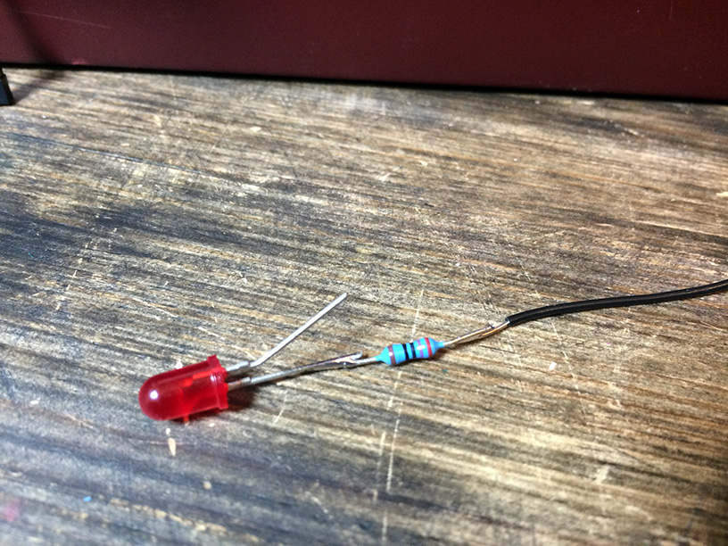
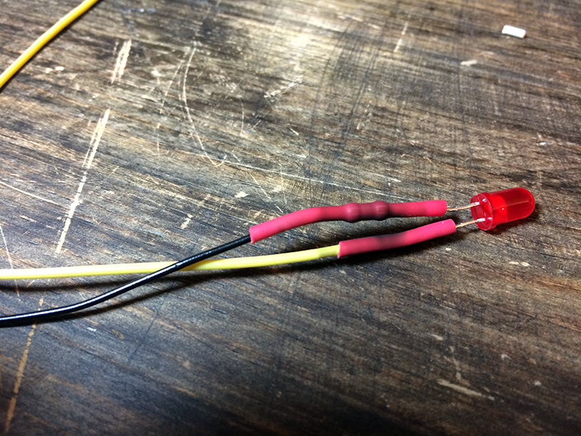
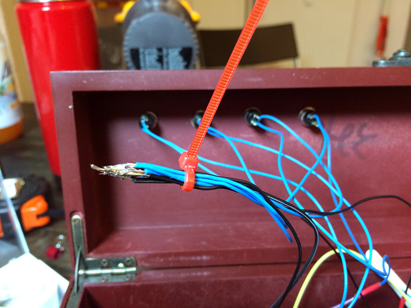
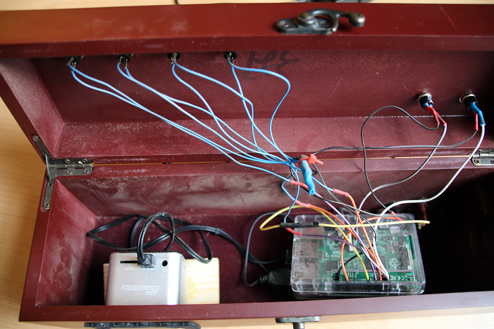
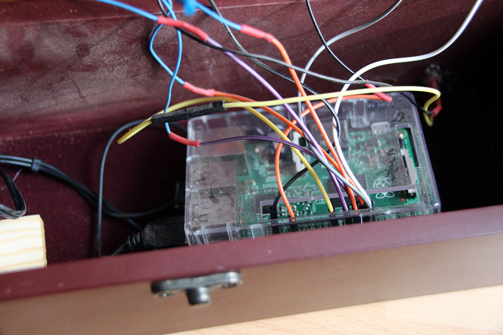
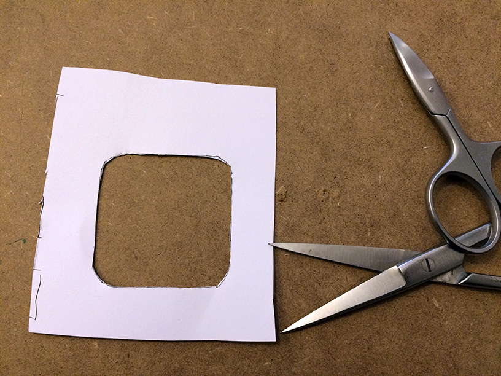
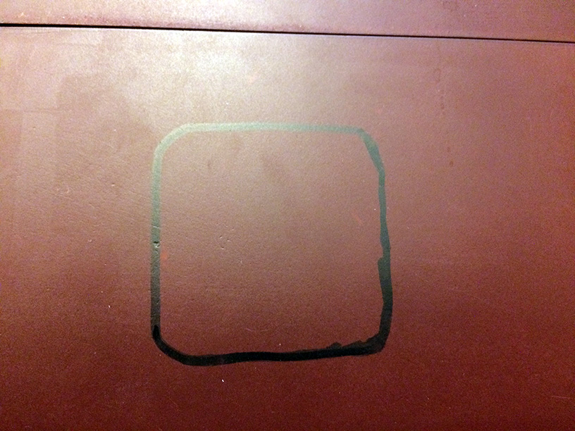
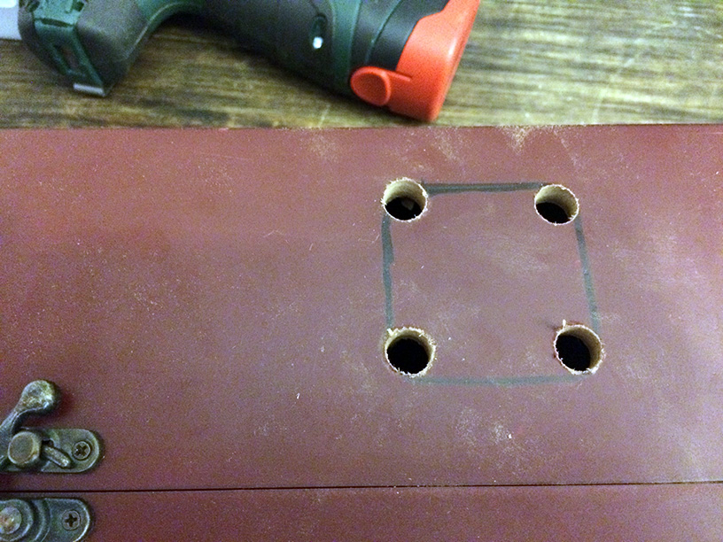
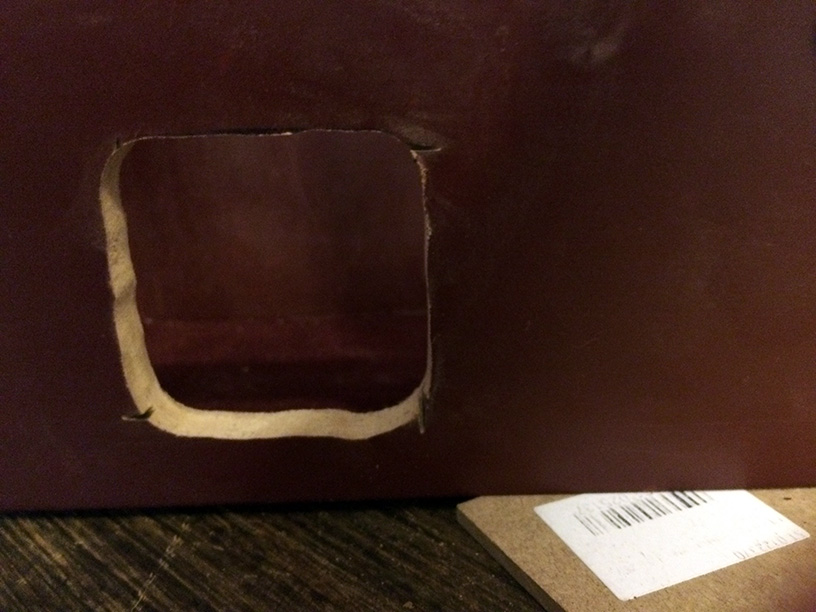
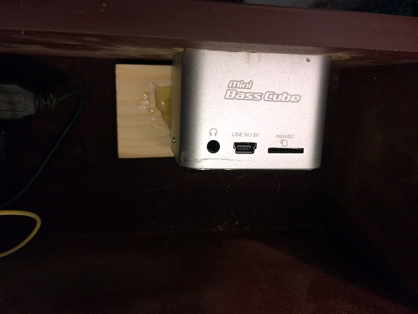
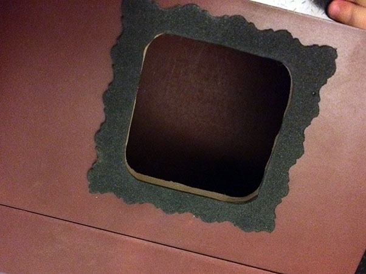
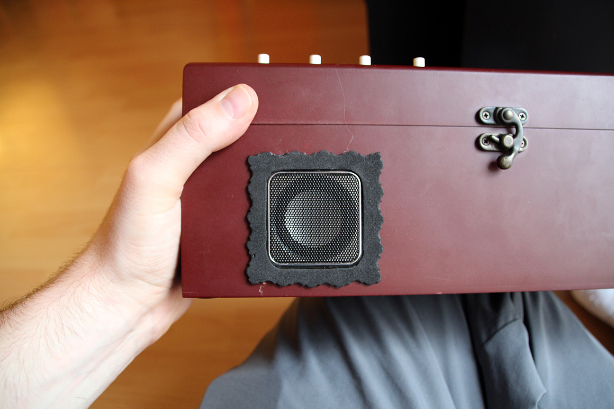
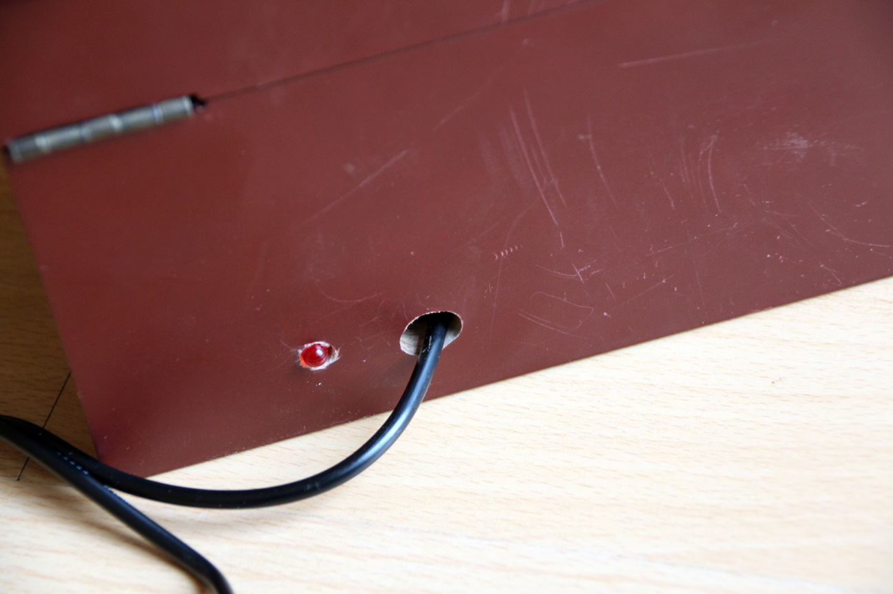
